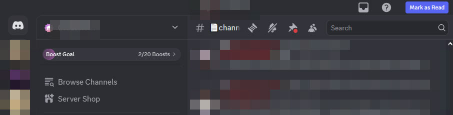

# Discord Mark-as-Read per server

Got tired of pressing *shift+Esc* on PC every now and then, so made an easier version of it as a Chrome and a Firefox extension. The actual load bearing scipt is exactly the same for both browsers.

As such, both extensions may violate Discord's TOS, so they are hosted here. Not tested on MacOS.

⚠️May break without notice.



## Version

Chrome: Worked for `stable 397720 (d46a552) Build.`

Firefox: Worked for `142.0.1 (64-bit)`.

## Installation

### Chrome

1. Download the [release](https://github.com/eerieA/discord-mar/archive/refs/tags/v397720.zip).
2. Unzip it.
3. Go to `chrome://extensions/`.
4. Enable "Developer mode" (top right).
5. Click "Load unpacked" and select the unzipped folder.
6. Reload your Discord web app if was open before.

### Firefox

1. Download the `.xpi` file from the [release](https://github.com/eerieA/discord-mar/releases/download/v142.0.1/discord-mark-as-read@ninja.com.xpi).
2. Open your Firefox profile folder. If don't know where it is, follow this:  
    ```
    about:support → Profile Folder → Open Folder
    ```
3. Create the folder `distribution/extensions` if it doesn’t exist.  
4. Copy the `.xpi` file into `distribution/extensions`. 
5. Restart Firefox.  
6. The extension should now appear in `about:addons` and stay enabled permanently.  